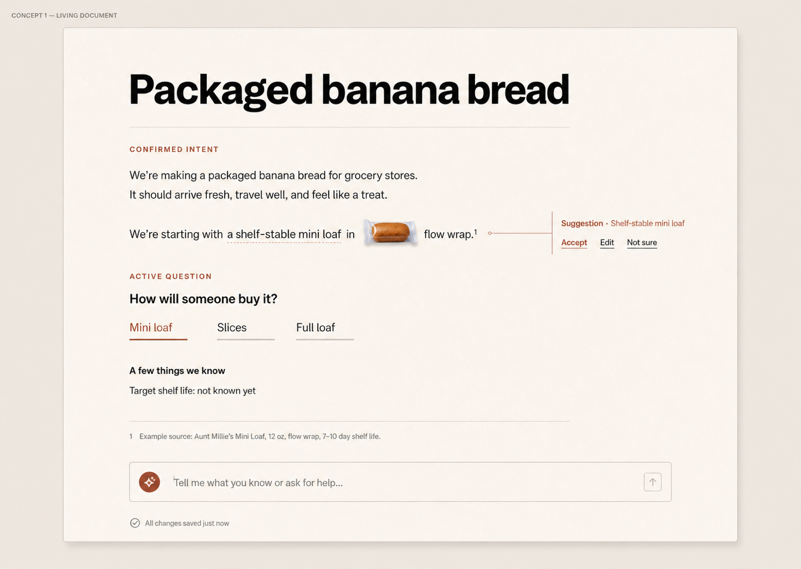
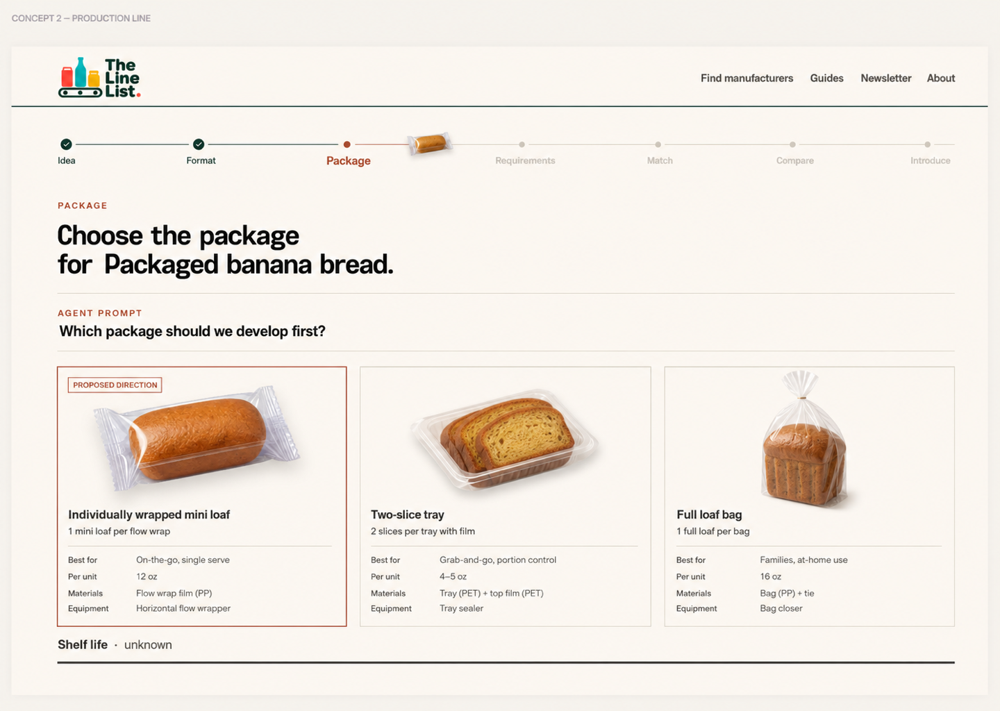
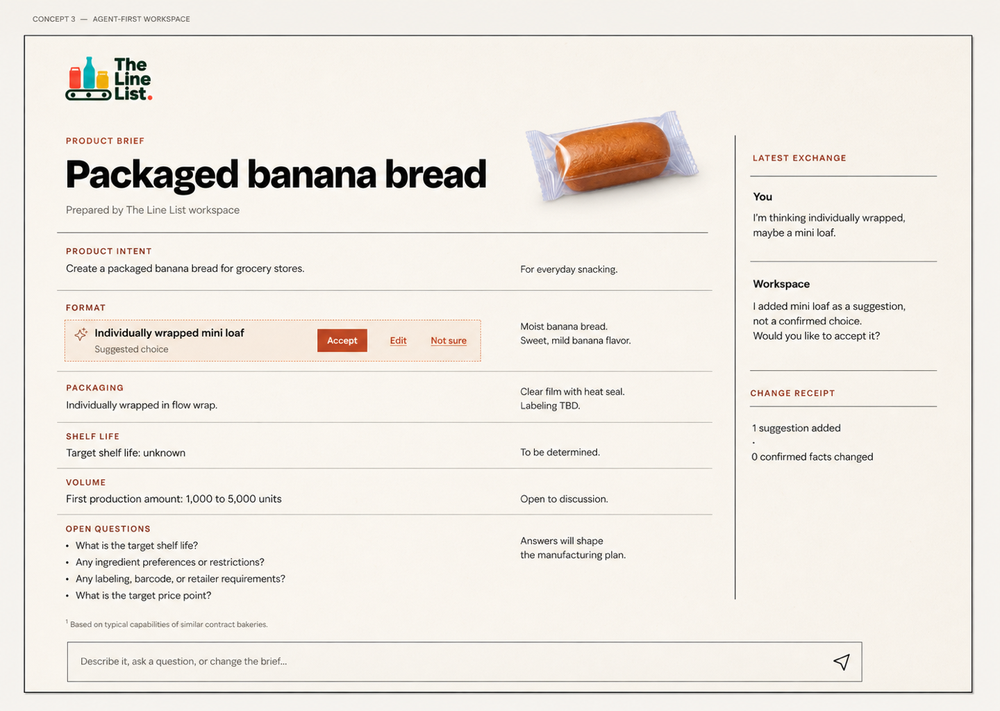
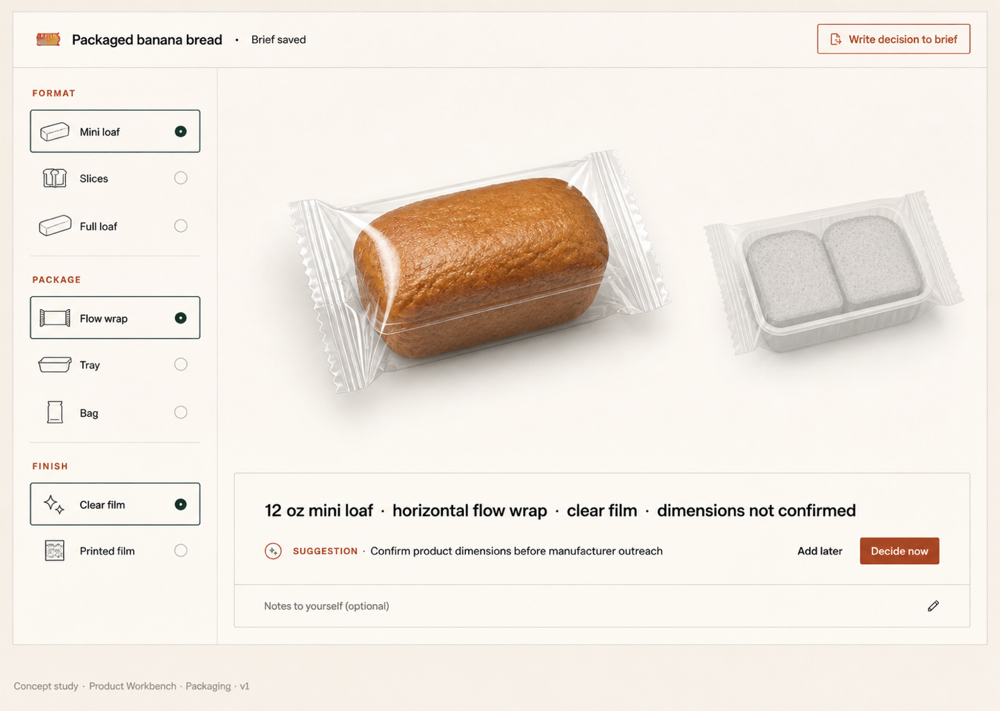

# Product Workspace: Four Experience Concepts

Status: Step 2 design exploration only  
Scope: Isolated concept work using fictional data; no production route, backend connection, or production component changes  
Primary scenario: A first-time founder arrives with only “Packaged banana bread.”

## Governing constraints

The workspace is an agent-assisted living product brief, not a conventional dashboard, questionnaire, or chatbot wrapper. There is one canonical product state. Founder statements may become confirmed facts; agent inferences remain proposals until accepted; unknowns remain honest unknowns; sourced findings retain their provenance; and any external outreach requires a separate, explicit founder approval.

The existing application is evidence of today’s vocabulary and brand—not a layout to preserve. These explorations retain the clay-like warmth, plain language, and beginner-friendly tone while deliberately leaving behind the current card grid, stage dashboard, progress treatment, and permanent side panels.

## Shared product-state grammar

Each concept renders the same underlying truth model differently:

| State | Meaning | Non-negotiable behavior |
| --- | --- | --- |
| Confirmed | The founder stated or explicitly accepted it | Written into canonical state; editable and reversible |
| Unknown | The founder does not know yet | Preserved as unknown; never silently filled |
| Suggested | The agent inferred a plausible answer | Visibly proposed; never treated as confirmed |
| Needs decision | A choice materially affects the next useful action | Asked in context, one consequential question at a time |
| Sourced | A claim is supported by external evidence | Source remains attached to the claim |

Manufacturer matching is intentionally tolerant of incompleteness. A founder can see broad, qualified possibilities before quantity or shelf life is known. Unknown facts explain match uncertainty; they do not become fabricated filters or blanket blockers.

## Pattern study and constraint payoff

These are borrowed interaction principles, not visual imitations.

| Product pattern | What is borrowed | Constraint it solves here |
| --- | --- | --- |
| [Google Docs suggestions](https://support.google.com/docs/answer/6033474?hl=en-4) | A proposal can sit beside the canonical artifact without changing it until accepted | Lets the agent help aggressively while keeping founder-confirmed state trustworthy |
| [Notion inline comments](https://www.notion.com/help/comments-mentions-and-reminders) | Questions attach to the exact text or block they concern and can collapse when resolved | Keeps unresolved work in context without adding a permanent task panel |
| [ChatGPT Canvas](https://help.openai.com/en/articles/9930697-what-is-the-canvas-feature-in-chatgpt-and-how-do-i-use-it%23.webp) | Conversation and an editable artifact share context; a selected passage can be revised and earlier versions restored | Makes the product brief the durable output rather than leaving the work trapped in chat |
| [Linear issue editing and history](https://linear.app/docs/editing-issues) | Direct editing, lightweight undo, and quiet change history | Supports confidence and reversibility without modal-heavy form flows |
| [Linear Peek](https://linear.app/docs/peek) | Supporting context can temporarily open without displacing the object being worked on | Allows evidence or a manufacturer profile to be inspected while preserving orientation |
| [Apple product configuration](https://www.apple.com/us/shop/buy-iphone/iphone-17) | Focused choices update a visible object immediately | Makes packaging decisions tangible while avoiding a long specification form |
| [Shopify product variants](https://help.shopify.com/en/manual/products/variants) | Alternatives remain explicit combinations rather than being flattened into one premature answer | Supports multiple packaging directions before one is chosen as active |
| [Figma contextual properties](https://help.figma.com/hc/en-us/articles/360039832014-Design-Prototype-and-view-Code-in-the-Properties-Panel) | Controls appear because of the selected object and current task | Prevents every possible product-development tool from becoming permanent chrome |
| [Autodesk Fusion workspaces](https://help.autodesk.com/cloudhelp/ENU/Fusion-GetStarted/files/GS-WORKSPACES.htm) | The toolset changes with the job while the underlying object persists | Gives 3D and comparison enough room when useful, then lets them disappear |
| [Stripe incremental onboarding](https://docs.stripe.com/connect/embedded-onboarding?locale=en-GB) | Collect only requirements that are useful now, then request more as the path becomes concrete | Avoids front-loading a founder with questions whose relevance is not yet known |

---

## Concept 1 — Living Document

### 1. Concept statement

The Line List feels like a product brief writing itself beside the founder. The page is both the conversation context and the canonical product artifact; the agent adds structure, annotations, evidence, and proposed language directly where it belongs.

### 2. Mental model

“I am making the brief clearer with a knowledgeable collaborator.” The document is the product. The agent behaves like an editor and product-development partner, not a separate chatbot or wizard.

### 3. First 60 seconds: “Packaged banana bread”

The founder sees a nearly blank sheet with one invitation: “What are you trying to make?” They type “Packaged banana bread.” The title becomes “Packaged banana bread,” and that exact statement appears as confirmed product intent. Beneath it, the agent inserts one short contextual question: “How do you picture someone buying it: one mini loaf, slices, or a full loaf?” In the margin it offers a tentative proposal—“A shelf-stable mini loaf may be a useful first direction”—with Accept, Edit, and Not sure. The page already feels owned; it is not waiting for a form to be completed.

### 4. Complete journey

The brief grows section by section as information becomes relevant: product intent, eating occasion, product format, packaging direction, requirements, manufacturer possibilities, shortlist rationale, outreach, and final packet. Empty sections do not occupy the page. Choosing packaging temporarily opens an inline visual configuration figure. Manufacturer research becomes a sourced section inside the same brief. Comparison becomes a decision memo. Outreach is assembled from the current brief and approved separately. The end state is the same artifact transformed into a credible, shareable product packet.

### 5. Screen and surface structure

The permanent surface is a centered editorial sheet with the product title, save/sync state, and a quiet agent entry field. Annotations sit in a narrow margin on desktop and fold inline on mobile. Evidence opens temporarily beside the sentence it supports. There is no permanent sidebar, stage bar, progress ring, activity panel, or card grid.

### 6. Agent behavior

- Founder-confirmed write: “Packaged banana bread” is written in normal ink as confirmed intent.
- Suggestion: “Shelf-stable mini loaf” appears as a tracked proposal with Accept, Edit, and Not sure.
- Unresolved: “Target shelf life” remains a plain unknown line, not an empty red validation field.
- Sourced finding: “Manufacturer A lists baked snack products” carries a visible source footnote and date.
- Explicit approval: “Send this introduction to Manufacturer A” is a distinct approval step with exact recipients, message, and attachment preview.

The agent asks one consequential question at a time and explains why it matters when the connection is not obvious.

### 7. Product-state behavior

Confirmed content uses normal document typography. Suggested content uses a soft clay underline and margin action, never a filled “AI” card. Unknowns are written as honest statements such as “Quantity: not known yet.” Needs decision appears as the single active inline question. Sourced content includes a compact footnote marker that opens its evidence. Color is supplementary; state remains legible through labels and marks.

### 8. 3D behavior

The 3D product appears only when a packaging decision benefits from spatial comparison. It is inserted as a figure directly under “Packaging direction,” where the founder can compare mini loaf, twin pack, or sliced tray and inspect proportions. Once a direction is accepted, the figure collapses to a small package thumbnail and a written specification. It does not remain as decorative wallpaper.

### 9. Incomplete manufacturer matching

For “sparkling energy drink, 12 oz slim can,” with quantity and shelf life unknown, the document adds a section titled “Possible manufacturing paths.” Candidate language is qualified: “Potential fit based on canned beverage capability; quantity and shelf-life compatibility are not yet confirmed.” A short note says, “Two unknowns would narrow this list,” but results remain visible. No manufacturer is labeled a match without evidence.

### 10. Comparison interaction

Comparison is a written decision memo rather than a giant table. Each candidate receives a three-part paragraph: evidence of fit, unresolved risk, and reason to keep or set aside. The founder can select a decision lens such as “lowest commitment,” “closest package fit,” or “fewest unknowns,” and the memo reorders while preserving citations. A temporary side-by-side view is available for two candidates only when needed.

### 11. Outreach transition

The document reaches a natural sentence: “This brief is specific enough to introduce.” Selecting “Prepare outreach” opens a proofing view with recipient, subject, exact message, included packet pages, and unresolved facts disclosed. Drafting does not send. A founder-only “Approve and send” action follows a final review and records what was approved.

### 12. Final packet payoff

The working document resolves into a clean, print-like product packet: concise summary, confirmed specifications, labeled unknowns, chosen packaging direction, requirements, evidence-backed manufacturer rationale, and contact context. The payoff is continuity—the founder recognizes the packet as the document they have been shaping all along.

### 13. Mobile behavior

The sheet becomes edge-to-edge with readable measure. Margin notes unfold immediately below their anchored sentence. The current question and composer rest in a bottom sheet that does not cover the text being edited. 3D opens full-screen for a deliberate packaging task, then returns the founder to the same paragraph and scroll position.

### 14. What this removes from the current implementation

The large welcome hero, visible multi-stage plan, progress meter, dashboard card grid, duplicated “current question” treatment, persistent product summary, permanent 3D panel, separate ChatGPT setup promotion, and tab-first navigation all disappear.

### 15. Risks

The document may initially feel less structured than a staged workflow. Long briefs can become harder to scan. Annotations need careful mobile behavior. Manufacturer exploration could feel buried if section navigation is too quiet. The design must provide just enough document outline and orientation without recreating a sidebar dashboard.

### 16. Why this is not generic SaaS slop

There is one primary object, almost no permanent chrome, and no stack of interchangeable cards. State is expressed through editorial behavior—writing, suggestions, questions, and footnotes. The form follows the actual work of turning an idea into a durable brief.

---

## Concept 2 — Production Line

### 1. Concept statement

The product moves through a quiet sequence of production stations, becoming more concrete at each one. The interface makes momentum tangible without pretending that product development is a percentage-complete checklist.

### 2. Mental model

“My product is moving through a real making process.” Each station has a clear purpose and output. Completed stations compress into a trace of decisions; the current station expands; future stations remain faint orientation markers.

### 3. First 60 seconds: “Packaged banana bread”

The founder enters the phrase at the start of a thin production path. An “Idea” station records it as confirmed and immediately compresses to “Packaged banana bread.” The product token moves to “Format,” which opens one focused prompt: “What should a customer hold: a mini loaf, slices, or a full loaf?” The founder sees motion and a next action, but no percentage, streak, celebration, or claim that the product is almost done.

### 4. Complete journey

The product passes through Idea, Format, Package, Requirements, Match, Compare, and Introduce. Stations are dependencies rather than mandatory form pages; the founder may reopen earlier decisions at any time. Packaging expands into a visual station. Requirements turn decisions into a compact specification. Match produces qualified manufacturer possibilities. Compare behaves like an inspection sequence. Introduce proves the message and packet before approval. Finished work leaves behind a readable production record.

### 5. Screen and surface structure

A narrow horizontal rail on wide screens—or vertical rail on compact screens—provides orientation. It is not a row of large cards. The current station occupies most of the canvas, completed stations reduce to text ticks, and future stations are labels only. A small product artifact travels with the current station. Save, undo, and product name are the only persistent controls.

### 6. Agent behavior

- Founder-confirmed write: the Idea station receives a quiet “confirmed” mark.
- Suggestion: the agent places “mini loaf” on the work surface as a proposed route, not as a completed station.
- Unresolved: a station can close with “quantity still unknown” when that unknown does not block movement.
- Sourced finding: the Match station pins the exact capability evidence beneath each candidate.
- Explicit approval: the Introduce station cannot release outreach until the founder reviews and approves the exact handoff.

The agent behaves like a calm process guide: it prepares the next workable setup, states what changed, and never moves a consequential decision without the founder.

### 7. Product-state behavior

Confirmed decisions become solid marks on the line. Unknowns remain open circles with plain labels. Suggestions are placed just off the line until accepted. Needs decision is the single active junction. Sourced findings carry a small document mark and source label. None of these states rely on traffic-light color alone.

### 8. 3D behavior

3D is the center of the Package station because proportions, format, and closure are the work there. The founder can compare physical directions while specifications update beside the object. After leaving the station, only a small package silhouette and the chosen written attributes travel along the line.

### 9. Incomplete manufacturer matching

At Match, the sparkling energy drink enters with “12 oz slim can” stamped as confirmed while quantity and shelf life remain open marks. The station produces a broad tray of possible facilities with statements such as “can-format evidence found; minimum run unknown.” The line may advance to exploration, but cannot mark a facility “qualified” until the unresolved constraints are checked.

### 10. Comparison interaction

The founder inspects one concern across all candidates at a time, similar to a quality-control bench. “Can format,” “minimum commitment,” “location,” and “unresolved evidence” are lenses. Candidates can be kept on the line, set aside, or marked for follow-up. This creates a sequence of judgments rather than a dense matrix of every field.

### 11. Outreach transition

The Introduce station assembles the current product record, candidate-specific questions, and a message. A physical-feeling release gate shows recipient, contents, disclosures, and what will happen next. “Prepare” and “Approve and send” are visibly separate actions. The line cannot imply that the agent sent anything during preparation.

### 12. Final packet payoff

The final artifact resembles a product dossier accompanied by a compact production trace: what was confirmed, what changed, what remains unresolved, and which evidence supported the shortlist. The product does not “graduate”; it becomes ready for the next real-world conversation.

### 13. Mobile behavior

The rail rotates vertically. Completed stations collapse above the current one; future stations remain a short text list below. Only one station is expanded at a time. Returning to an earlier decision preserves the current downstream implications and explains what may need reconsideration.

### 14. What this removes from the current implementation

The welcome dashboard, independent stage cards, circular progress indicator, multiple competing summaries, persistent side panels, and tabbed sub-app feeling are replaced by one continuous path and one expanded work surface.

### 15. Risks

The line can imply a falsely rigid order or manufacture gamified completion pressure. Reopening earlier decisions could be cognitively expensive. Some products need parallel exploration. The visual metaphor could become theatrical if stations look literal or industrial rather than quiet and editorial.

### 16. Why this is not generic SaaS slop

The organizing structure is a dependency path, not dashboard furniture. Completed work physically compresses, current work earns space, and future work stays out of the way. The metaphor is useful because it explains momentum and prerequisite relationships.

---

## Concept 3 — Agent-First Workspace

### 1. Concept statement

The Line List feels like a live working session with an agent in which every useful statement becomes an inspectable product artifact. Conversation drives action, but the artifact—not the transcript—remains the durable center of gravity.

### 2. Mental model

“I can describe what I mean naturally, and watch a trustworthy brief take shape.” The agent is the input method and working partner. The product brief is the record. The latest exchange is visible; old conversation compresses into change history instead of becoming an endless chat log.

### 3. First 60 seconds: “Packaged banana bread”

A generous prompt asks, “What are you trying to make?” The founder enters the phrase. The product brief appears immediately and occupies most of the screen, with “Packaged banana bread” recorded as confirmed intent. The agent’s latest response remains nearby: “Added as your product direction. I can help make it specific. Do you picture one mini loaf, slices, or a full loaf?” A receipt states exactly what changed. There are no greeting bubbles, bot avatar, or fake typing ritual.

### 4. Complete journey

The founder speaks or types naturally. The agent translates clear founder statements into canonical fields, offers uncertain interpretations as suggestions, and summons small task tools inside the exchange when words alone are insufficient. Packaging choices, manufacturer evidence, and comparison lenses appear temporarily. Accepted results flow into the brief. Earlier conversation recedes into a searchable change log. Outreach moves into a proof-and-approve mode. The final packet is generated from the visible artifact, not reconstructed from chat memory.

### 5. Screen and surface structure

The brief controls roughly two-thirds of the desktop canvas. A narrow session area shows the active prompt, the latest response, and a change receipt—not the full transcript. The composer remains available without dominating the layout. Direct editing of the brief is always possible. Supporting tools replace the session area temporarily, then collapse when their task is complete.

### 6. Agent behavior

- Founder-confirmed write: “Packaged banana bread” is written directly, followed by “Added to Product intent.”
- Suggestion: “Likely sold as an individually wrapped mini loaf” appears in the brief as an unaccepted interpretation.
- Unresolved: “I don’t know the shelf life” writes “Shelf life: unknown,” then the agent explains when it will matter.
- Sourced finding: “Facility B lists carbonated canned beverages” appears with the source and retrieval date in the artifact.
- Explicit approval: when asked to contact a facility, the agent prepares the message and says it is ready for review; only the founder can approve sending.

### 7. Product-state behavior

The artifact uses the same conservative grammar as the Living Document, while change receipts make state transitions explicit: “1 confirmed fact added,” “1 suggestion waiting,” or “No product state changed.” Suggested language cannot become ordinary text just because it appeared in the conversation. Sourced findings remain linked after the conversational turn disappears.

### 8. 3D behavior

The agent summons 3D in direct response to a packaging question: “Show me what a mini loaf and a two-slice tray would feel like.” The model appears beside the relevant brief section with focused controls. When the choice is made, the tool collapses, the specification is written, and a thumbnail remains. 3D is a conversationally invoked instrument, not the permanent background.

### 9. Incomplete manufacturer matching

For the sparkling energy drink scenario, the agent responds: “I found broad possibilities based on a 12 oz slim can. Quantity and shelf life are still unknown, so these are not yet qualified matches.” The artifact records the two confirmed facts, the two unknowns, candidate evidence, and the questions needed to narrow. The founder can continue naturally: “Which are closest to Texas?” without losing qualification boundaries.

### 10. Comparison interaction

Comparison is an interrogable shortlist. The founder asks questions such as “Which has the strongest can-format evidence?” or selects a suggested lens. Candidate order changes with a visible reason and source receipt. The canonical shortlist records keep, set aside, and unresolved decisions. A full matrix exists only as an export or specialist view, not the default experience.

### 11. Outreach transition

The founder can say, “Draft an introduction to the first two.” The agent creates separate candidate-aware drafts and a packet preview, then the surface changes from conversation to approval proof. Recipient, message, attachments, unresolved claims, and expected action are explicit. A natural-language request to send may initiate the review, but it does not bypass founder confirmation.

### 12. Final packet payoff

The packet proves that conversational work became durable structure. It contains confirmed requirements, visibly unresolved fields, selected visuals, cited research, shortlist rationale, and outreach-ready context. The founder can edit any section directly before sharing.

### 13. Mobile behavior

Mobile uses a focus toggle between Brief and Session, while preserving a small indicator of pending suggestions or changes. The latest agent turn can peek over the brief rather than forcing a permanent split screen. Dictation is useful, but all proposed writes still receive visible state treatment. Packaging and proofing tools become focused full-screen tasks.

### 14. What this removes from the current implementation

The separate ChatGPT onboarding card, manual-versus-agent fork, large plan dashboard, persistent stage navigation, redundant summaries, full activity feed, and conventional chatbot transcript all disappear. Agent assistance becomes the core interaction rather than an attached feature.

### 15. Risks

Conversation may still overpower the artifact. Users may not discover direct editing. Agent latency or uncertain tool availability could interrupt the experience. Change receipts can become noisy. A cross-tab or external-agent workflow must remain progressive enhancement; the product needs a complete manual input path.

### 16. Why this is not generic SaaS slop

It is not a dashboard with a chatbot card, nor a two-pane copy of ChatGPT. The transcript is deliberately temporary, the artifact is visually dominant, and every agent action produces an inspectable change or an explicit no-change result.

---

## Concept 4 — Product Workbench

### 1. Concept statement

The Line List feels like a professional product-development bench that brings forward only the tool needed for the current job. The product brief remains the stable object while the surrounding workspace changes shape for writing, packaging, matching, comparison, or proofing.

### 2. Mental model

“My product is on the bench; I am choosing the right instrument for the decision in front of me.” This borrows the contextual discipline of creative and CAD tools without importing their density or expert jargon.

### 3. First 60 seconds: “Packaged banana bread”

The founder begins in a minimal idea editor. The phrase becomes the product anchor at the top of the bench. The agent asks one question—“What should someone hold when they buy it?”—and offers mini loaf, slices, and full loaf as plain alternatives. Selecting “mini loaf” changes the bench into a restrained package study: the product appears at useful scale, and only format-relevant controls become visible. The layout change communicates that the work changed.

### 4. Complete journey

The workspace moves through task modes without creating separate products: an editorial idea bench, a package lab, a requirements proof, an evidence lens for matching, a decision lens for comparison, and a send-proof surface for outreach. The canonical brief remains accessible as a compact anchor or opens fully on demand. Each tool writes results back into it. Tools disappear once their task no longer benefits from specialized space.

### 5. Screen and surface structure

The product name, save/undo, canonical-state indicator, and quiet agent command are permanent. Everything else is contextual. The central canvas belongs to the current object or decision. A sparse property rail may appear when an object is selected; evidence may peek in temporarily; the brief can unfold from its anchor. There are no permanent left navigation, right inspector, bottom timeline, and top stage bar competing at once.

### 6. Agent behavior

- Founder-confirmed write: the product anchor records “Packaged banana bread” and shows a compact confirmation receipt.
- Suggestion: the agent places “individually wrapped mini loaf” on the bench as an alternative, visibly uncommitted.
- Unresolved: “Shelf life unknown” remains attached to the requirements proof and influences later confidence.
- Sourced finding: selecting a manufacturer claim opens an evidence peek with the exact source context.
- Explicit approval: the send-proof bench requires the founder to inspect and approve the exact external action.

The agent selects or prepares tools but does not operate irreversible controls on the founder’s behalf.

### 7. Product-state behavior

Confirmed attributes are fixed to the product anchor. Unknowns remain hollow, labeled slots only when relevant to the current tool. Suggestions sit in a temporary tray until accepted. Needs decision activates one tool and explains the downstream consequence. Sourced claims show a provenance tab that travels with the claim. State remains readable when a tool closes.

### 8. 3D behavior

This concept gives 3D its strongest role. During packaging, the product occupies the center at decision-making scale. The founder can compare format, dimensions, closure, finish, and artwork placement while seeing written specifications update. Controls are constrained to manufacturable choices. Leaving the package lab collapses the model to a thumbnail and written decision; it does not persist in matching or outreach unless referenced.

### 9. Incomplete manufacturer matching

The sparkling energy drink opens an evidence lens centered on the confirmed 12 oz slim can. Quantity and shelf life appear as unresolved constraints at the edge of the lens. Candidate facilities are organized by evidence strength and which unknown would most change their viability. The founder can inspect possibilities immediately, but “qualified” remains unavailable until enough supporting facts are confirmed.

### 10. Comparison interaction

The workbench offers decision lenses, one at a time: package evidence, minimum commitment, geography, certifications, or unresolved risk. Candidate artifacts align around the selected concern, and the founder can pin a finding to the shortlist rationale. This is closer to examining objects with instruments than filling a spreadsheet. A raw table is an optional expert export.

### 11. Outreach transition

The workspace becomes a proofing bench. The exact packet sits beside the exact candidate-aware message, with unresolved facts visibly disclosed. The agent can suggest edits and flag unsupported claims. “Approve and send” is a distinct founder control with recipient and attachment count embedded in the action label.

### 12. Final packet payoff

The final packet feels like the object leaving the bench: a restrained, professional dossier with product visuals, confirmed specification, unknowns, source-backed findings, and a clear ask. Its contents correspond directly to the tools the founder used, so it feels assembled through real decisions rather than generated from a template.

### 13. Mobile behavior

Each tool becomes a single full-screen mode. The product anchor remains compact at the top and the canonical brief opens as a sheet. Tool transitions preserve the selected object and return point. 3D uses touch gestures only where they support a real comparison; all values remain available in text and controls.

### 14. What this removes from the current implementation

Permanent stage navigation, dashboard summaries, fixed cards, always-visible 3D, separate detail panels, and generic workspace chrome disappear. Specialized UI appears only when the current product decision earns it.

### 15. Risks

Changing workspace geometry can disorient users. Each tool mode raises design and implementation cost. Inconsistent transitions could make the product feel like several mini-apps. The brief anchor must be strong enough to maintain continuity. A CAD-inspired surface can become intimidating if it exposes too many controls.

### 16. Why this is not generic SaaS slop

The surface is determined by the material decision, not a reusable dashboard template. Tools have an entrance condition, a specific job, and an exit condition. The interface earns complexity temporarily and then gives the space back.

---

## Comparative scorecard

Scores are 1–10. For Implementation complexity, 1 means simplest to build well and 10 means hardest.

| Criterion | Living Document | Production Line | Agent-First | Product Workbench |
| --- | ---: | ---: | ---: | ---: |
| Next-action clarity | 8 | 9 | 9 | 8 |
| Beginner friendliness | 9 | 8 | 10 | 8 |
| Agent integration | 9 | 7 | 10 | 8 |
| Persistent artifact | 10 | 8 | 8 | 9 |
| Sense of progression | 6 | 10 | 7 | 8 |
| 3D usefulness | 6 | 8 | 7 | 10 |
| Matching clarity | 7 | 8 | 8 | 9 |
| Progressive complexity | 9 | 8 | 9 | 10 |
| Mobile viability | 9 | 8 | 7 | 7 |
| Visual simplicity | 10 | 8 | 8 | 8 |
| Distinctiveness | 9 | 9 | 8 | 10 |
| Implementation complexity | 6 | 7 | 8 | 10 |

The numbers intentionally expose tradeoffs instead of manufacturing a winner by average. Production Line has the clearest visible momentum; Agent-First has the most natural initial input; Product Workbench makes specialist tools most useful; Living Document holds the clearest and most durable governing model.

## Recommendation

### A. Strongest overall concept

Living Document is the strongest overall direction. It makes the canonical-state rule spatially obvious: there is one artifact. It gives agent proposals a natural home, treats unknowns without shame, works well on mobile, and reaches the final packet without a conceptual handoff. Most importantly, it is the simplest answer to the founder’s job: make my idea specific enough to manufacture and discuss.

### B. Strongest individual ideas

- Living Document: inline suggestions and source footnotes attached to the exact product statement.
- Production Line: completed work compresses while the current decision earns the canvas.
- Agent-First: the latest exchange and a precise change receipt replace an endless transcript.
- Product Workbench: contextual tools and decision lenses appear only when the material task requires them.

### C. Ideas that should not be combined

Do not combine a permanent conversation column, permanent production rail, and shape-shifting workbench. That would create three competing navigation models. Do not place a production progress spine beside a document outline. Do not keep 3D visible after packaging merely to make the workspace feel designed. Do not expose both card-based manufacturer browsing and decision-lens comparison at the same time.

### D. Is a hybrid justified?

A narrow hybrid is justified only after selecting Living Document as the governing model. The document may temporarily open a Product Workbench mode for packaging and a decision-lens mode for comparison, then write the result back into the same document and close. Production Line should remain an alternative concept, not added as another layer. Agent-First can contribute the change-receipt behavior without making chat the layout.

### E. Strongest magic moment

Product Workbench has the strongest isolated magic moment: a plain phrase becomes a spatial packaging study, the founder changes from mini loaf to sliced tray, and both the 3D object and written manufacturing specification update together. The moment earns its visual richness because it resolves a real physical decision.

### F. Least generic SaaS direction

Living Document is least generic overall because it removes almost all application furniture and lets the artifact become the interface. Product Workbench is the most visually distinctive, but it risks becoming a beautifully specialized app suite. Living Document is quieter and more conceptually original for this job.

## Answer to the defining question

The simplest interaction model is an editable living brief with one unresolved question embedded exactly where it belongs. The agent writes explicit founder statements directly, places interpretations as accept-or-edit suggestions, attaches evidence to sourced claims, and opens a specialized tool inline only when text is insufficient. Every interaction makes the same artifact more manufacturable until that artifact becomes the packet a founder can confidently approve and share.

## Visual exploration brief

The accompanying visual studies should show one representative desktop moment per concept at 1440 × 1024. They use restrained grayscale and warm paper/clay neutrals first, with minimal accent color. Each study must be recognizable from its spatial model before its label is read:

1. Living Document: an editorial sheet with one active inline question and one margin suggestion.
2. Production Line: a quiet process path with one expanded station and compressed completed work.
3. Agent-First Workspace: a dominant product artifact with only the latest agent exchange and a change receipt.
4. Product Workbench: a packaging lab with a central useful 3D object and contextual controls.

These are design studies, not implementation specifications. Selection and critique should happen before any production build.
